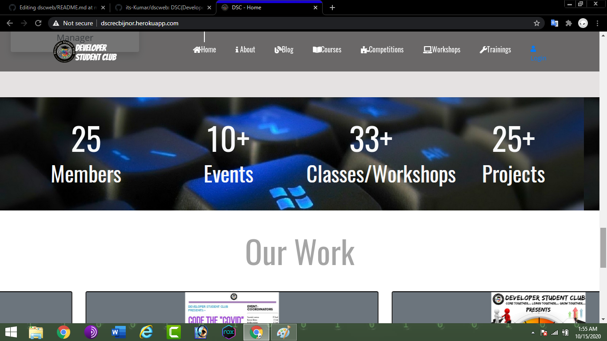
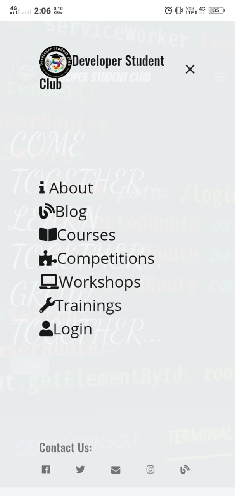
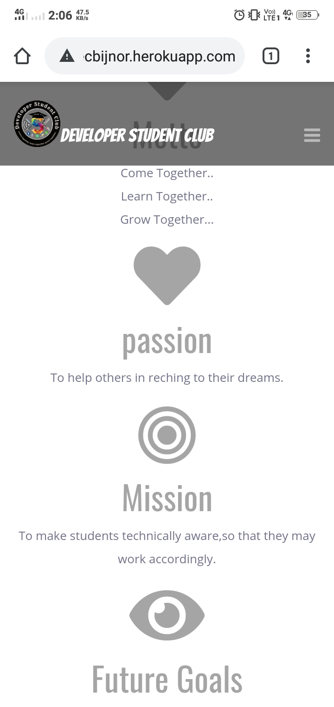

# DSCWEB

  **DSC(Developer Student Club)** is a official Technical club running in [Rajkiya Engineering College, Bijnor](http://recb.ac.in/) since 2019. DSCWEB is a web project to build website for **DSC club.**

---

# DESKTOP VIEW

- view 1

  

- view 2

  

- view 3

  

  ---


# MOBILE VIEW

- **view 1**

  

- **view 2**

  

- **view 3**

  

- **view 4**

  

---

## Links:

- [Facebook](https://www.facebook.com/dscrecbijnor/)
- [Twitter](https://twitter.com/DscRec)
- [Instagram](https://www.instagram.com/dscrecbijnor/?igshid=b8dp92k5qnhu)

---

## Project Status

- Completed

## Project Details

This project is built on the *Django Framework(3.0)*. This project is build by [Developer Student Club Team](https://www.dscrecbijnor.com) headed by [Kumar Shanu](https://github.com/its-Kumar)(at Back-end Developement) and [Rajat Yadav](https://github.com/rajatyadav8540/)(at Front-end Development).


---

## Developement

### Running the Server

1. Run the following command to activate the environment:

  ```bash
  cd path/to/dir
  pip install pipenv
  pipenv shell
  ```
2. After that install all dependancies specified in Pipfile or Pipfile.lock :

  ```
  pipenv sync
  ```
3. Run the server using :
  ```
  python manage.py runserver 8000
  or
  pipenv run python manage.py runserver
  ```
  here 8000 is port number. you can use any port number you want.

4. To install any package :
  ```
  pipenv install package_name
  pipenv update  //run this at last
  ```
  It will automaticlly install the package and put it into requirements.

### Admin

    django admin : dsc
    password :
