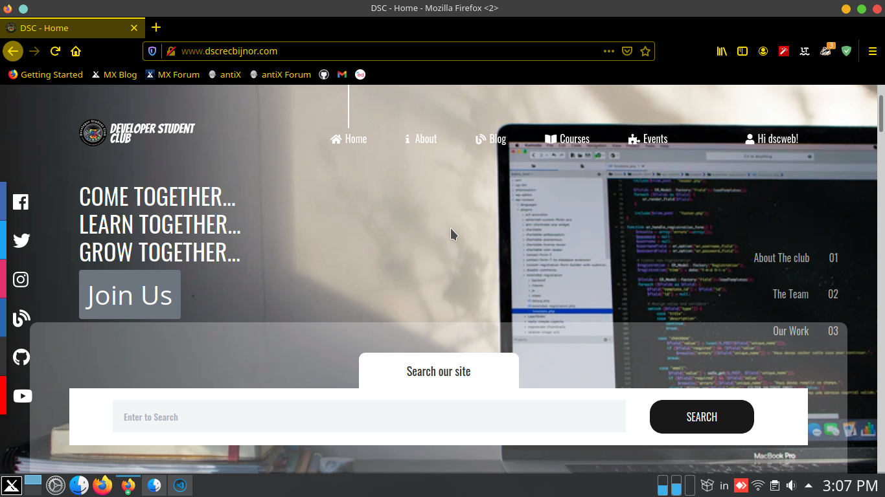
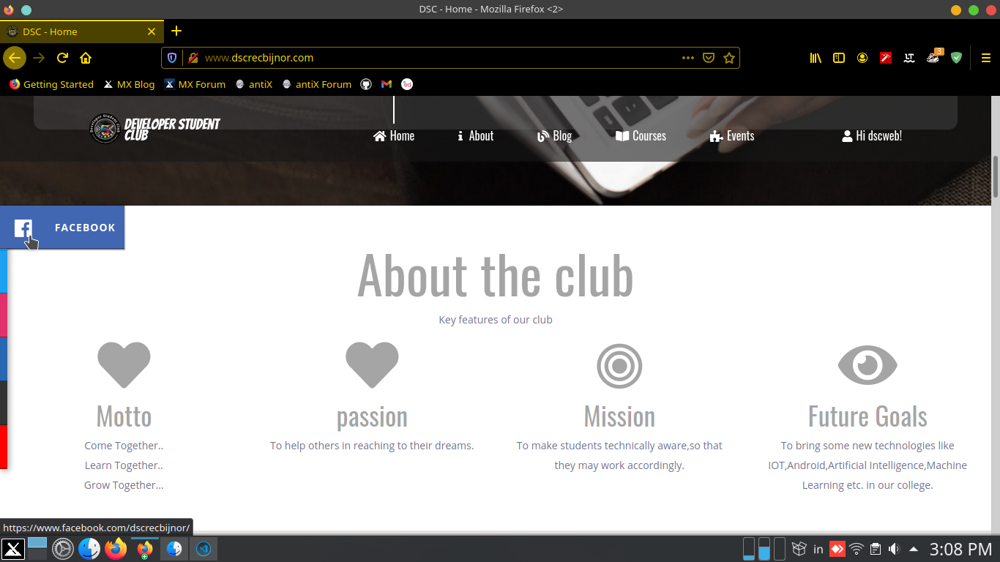
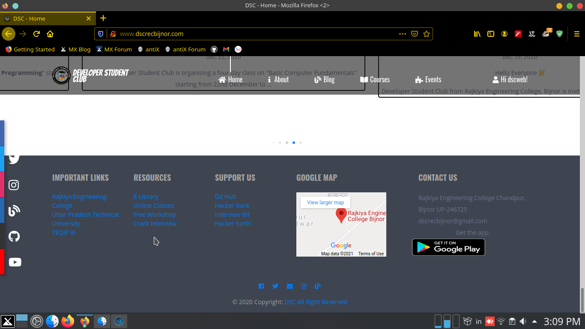
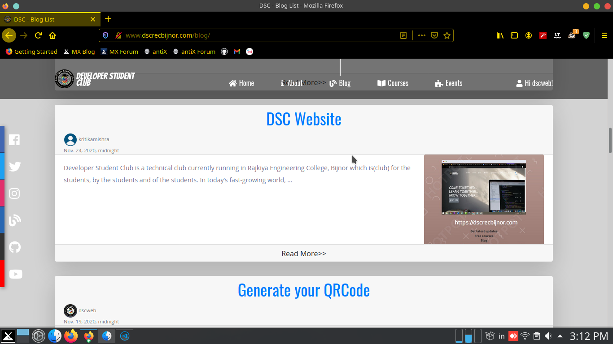

# DSCWEB

  **DSC(Developer Student Club)** is a official Technical club running in [Rajkiya Engineering College, Bijnor](http://recb.ac.in/) since 2019. DSCWEB is a web project to build website for **DSC club.**

---

## Project Details

  

  
  
  

  This project is built on the *Django Framework(3.0)*. This project is build by [Developer Student Club Team](https://www.dscrecbijnor.com) headed by [Kumar Shanu](https://github.com/its-Kumar)(at Back-end Developement) and [Rajat Yadav](https://github.com/rajatyadav8540/)(at Front-end Development).

## DESKTOP VIEW

- view 1

  

- view 2

  

- view 3

  

- view 4

  ---

## MOBILE VIEW

- **view 1**

  

- **view 2**

  

- **view 3**

  

- **view 4**

  

---

## Development

### Github Flow

  1. Clone the repo `$ git clone https://github.com/its-Kumar/dscweb`

  2. Change directory `$ cd ./dscweb`

  3. Create a branch with your name and checkout  `$ git checkout -b <yourname>-branch`

  4. Change the code
  5. Add the changes and commit
  6. push the changes  `$ git push origin <yourname>-branch`

### Project Setup

  1. install Poetry `$ pip install poetry`

  2. Activate the Environment `$ poetry shell`

  3. Install packages `$ poetry install`

  4. Migrate the database `$ python manage.py migrate`

  5. Run server `$ python manage.py runserver`

  6. Install Extra package (Optional) `$ poetry add package_name`

## Links

- [Facebook](https://www.facebook.com/dscrecbijnor/)
- [Twitter](https://twitter.com/DscRec)
- [Instagram](https://www.instagram.com/dscrecbijnor/?igshid=b8dp92k5qnhu)
